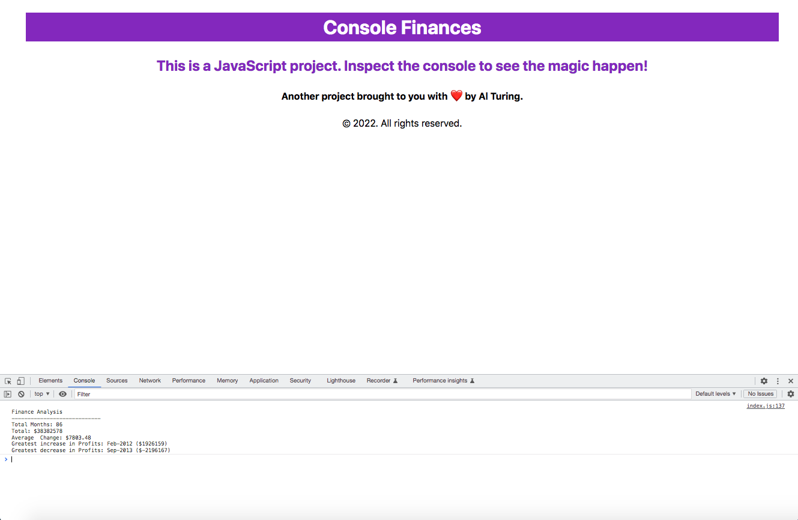

# Console Finances

## A JavaScript / Console project

### Deployment / Code Repository

[Live deployment](https://tweetingcynical.github.io/Console-Finances/)

[Repository](https://github.com/TweetingCynical/Console-Finances)

### Scope and Purpose

Build a console output based on analysing provided data inside an inner array variable.

### Pseudocode

Steps to finding solution for Console Finances:

1) Count the number of items in the array;
2) Store the above value as months
3) Sum the amounts in position 1 of each array element;
4) Store the above value as Total;
5) Add a third element to each array, [month, amount, diff];
6) Calculate the difference between amount for each month until all months are calculated;  
7) Perform calculation on the new element (difference) as follows: Sum(difference) / NumberOfMonths
8) Store the above value as AveragePL;
9) Sort the finances var by new column, difference;
10) Access the first and last rows for the greatest increase and decrease in profit;
11) Build text for return to console:

    "Financial Analysis" +
    "----------------------------" +
    Total Months: " + months +
    "Total: $" + total +
    "Average Change: $" + AveragePL +
    "Greatest Increase in Profits: " + LargestPLMonth + "($" + LargestPL +")" +
    "Greatest Decrease in Profits: " + SmallestPLMonth + "($" + SmallestPL +")" +

### Overview of Build

Some of the key JavaScript skills being utilised:
- Use of let and var for different purposes;
- Declaring variables early in the code;
- Use of variable.length to find how many data instances there are;
- Use of nested for...in loops to iterate through both rows, and columns of an inner array;
- Use of if(typeof) to perform actions on one type of data within an array;
- Use of !== for the same;
- Use of total += in place of total = total +
- Use of finances[row].push(diff); inside for loop, to add the new calculation as a third column to each inner array;
- Reduce to perform sum action on one column of the array;
- .toFixed(2) to round a calculation to monetary format;
- Use of sort function to establish the highest (first row) and lowest (last row) values of new index 2;

    finances = finances.sort(function(a,b) {
      return b[2]-a[2]
    });

- Use of back ticks for concatenation (string literals);
- Use of $ to create placeholders in string literals such as ${months};
- Use of ${finances[finances.length - 1][0]} ($${finances[finances.length - 1][2]}) to reference specific array rows and columns in the finances variable after sorting.

## Suggested future changes

- Add formatting of the monetary values to make reading of larger numbers easier (comma separated thousands):

    total = total.toLocaleString('en-US', {
      minimumFractionDigits: 2,
      maximumFractionDigits: 2
    })

## Screenshot

Working version of site should look like this at standard screen size:

## License

MIT License

Copyright (c) 2022 TweetingCynical

Permission is hereby granted, free of charge, to any person obtaining a copy of this software and associated documentation files (the "Software"), to deal in the Software without restriction, including without limitation the rights to use, copy, modify, merge, publish, distribute, sublicense, and/or sell copies of the Software, and to permit persons to whom the Software is furnished to do so, subject to the following conditions:

The above copyright notice and this permission notice shall be included in all copies or substantial portions of the Software.

THE SOFTWARE IS PROVIDED "AS IS", WITHOUT WARRANTY OF ANY KIND, EXPRESS OR IMPLIED, INCLUDING BUT NOT LIMITED TO THE WARRANTIES OF MERCHANTABILITY, FITNESS FOR A PARTICULAR PURPOSE AND NONINFRINGEMENT. IN NO EVENT SHALL THE AUTHORS OR COPYRIGHT HOLDERS BE LIABLE FOR ANY CLAIM, DAMAGES OR OTHER LIABILITY, WHETHER IN AN ACTION OF CONTRACT, TORT OR OTHERWISE, ARISING FROM, OUT OF OR IN CONNECTION WITH THE SOFTWARE OR THE USE OR OTHER DEALINGS IN THE SOFTWARE.